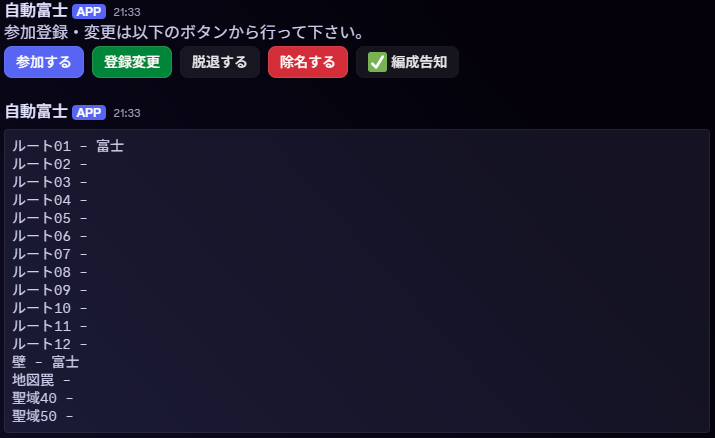

# ネトゲコミュニティ Discord 用パーティ編成 BOT

- ウェブフックタイプの Discord BOT
- 参加ボタンを押すとルートとロールの希望を聞き、先着順に自動で割り振り

## 技術

- Serverless Framework
- AWS Lambda
- Firebase Firestore
- Discord.js

## 使い方

- Serverless Framework の説明を見る
- DiscordBOT と Firestore を利用開始する
- `config.json.example` を真似て、Firebase のサービスアカウントと DiscordBOT のキーを`config.json`に登録
